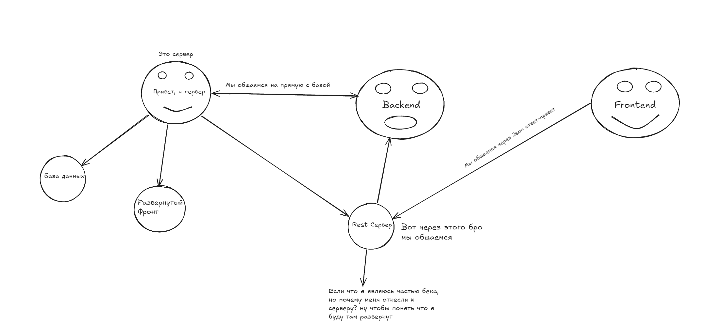

## Начало создания

### 1 Определиться полностью с функционалом 

- **Какие основные функции должны быть?**
- **Что эти функции делают?**

Можно сказать что смысл этого этапа в описании логики приложения пускай не досконально, но основной функционал. Это нужно для того чтобы начать проектировать базу данных определиться с основными сущностями(таблицами) и тем что они буду в себе хранить, далее переходим к этапу написания голого Backend, будем писать на GO, никаких сложностей, быстрота и никаких проблем с расширяемостью.
### 2 Проектирование базы данных

После того как мы определилась с примерным функционалом, начинаем создать базу данных. Создать несколько Основных таблиц и перейдем к пункту 3

### 3 Написание Backend

#### Первый этап

На первом этапе просто пишем отдай-получи из базы, пишем коннект к базе и взаимодействуем с основными таблицами

---
### Схема взаимодействия клиента с базой данных

#### Сервер

на сервере лежит база данных в PostgreSql, особенности проектирования базы(см тут), через Rest Api происходит взаимодействия базы с клиентом, ответ-привет в виде json файла, например рест метод Get позволяет получить определенную инфу с базы( это тот же селект), на беке написано реализация получения из базы, далее также же в беке в Handler(папка обработчик) привязываем метод Get к функции написанной ранее для получения из базы, остальное +- также будет работать, только разные Sql запросы

Также, на сервере будет развернут и Frontend, по мимо Rest сервера.

#### Как все будет взаимодействовать?

